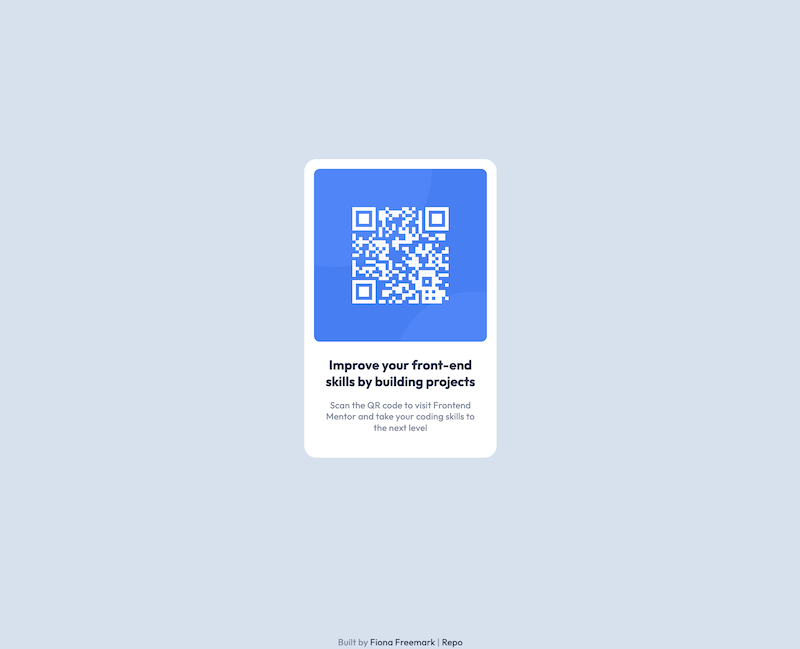

# Frontend Mentor - QR code component solution

This is a solution to the [QR code component challenge on Frontend Mentor](https://www.frontendmentor.io/challenges/qr-code-component-iux_sIO_H). 

## Table of contents

- [Overview](#overview)
  - [Screenshot](#screenshot)
  - [Links](#links)
- [My process](#my-process)
  - [Built with](#built-with)
- [Author](#author)

## Overview

### Screenshot

### Links

- Solution URL: [Add solution URL here](https://your-solution-url.com)
- Live Site URL: [Add live site URL here](https://ff-fem-qr-code.netlify.app/m)

## My process
I have been working in React with Sass a lot recently, and though its logical to use those to build a component, I haven't build something in simple HTML/CSS for some time. I thought I'd use this starter project as a quick refresher and aim to build it with React/Sass at a later time. 
My process was to map out how each of the HTML elements would be nested together so I could easily style them later on. Then I used the Figma file to outline the specific typography styles and filled in the rest of the positioning afterward.
### Built with

- Semantic HTML5 markup
- CSS custom properties
- Flexbox

## Author

- Website - [Add your name here](https://freemark.dev)
- Frontend Mentor - [@fionafreemark](https://www.frontendmentor.io/profile/fionafreemark)
